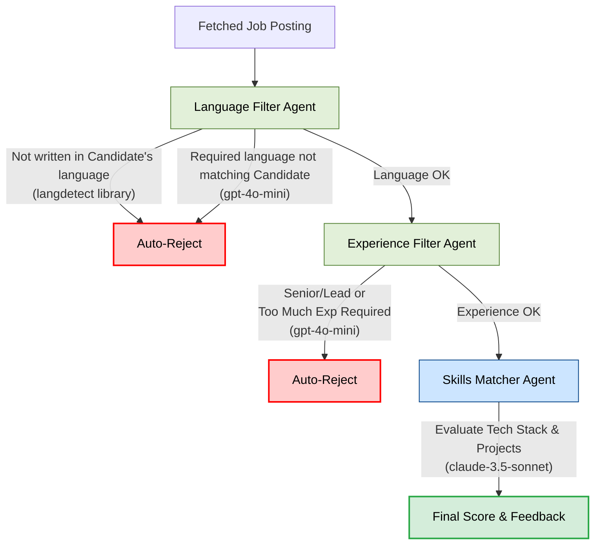

# AI Job Fetching Agent

An automated pipeline designed to scrape, evaluate, and fetch job listings tailored to specific criteria. This project uses web scraping and an AI agent to match job descriptions against user-defined preferences.

- **Job Scraping**: Automatically fetches job listings (e.g., AI Engineer, Robotics Engineer) in specified locations.
- **Multi-Agent Evaluation Pipeline**: Analyzes job descriptions using a funnel of multiple specialized AI agents (Language, Experience, and Skills) to accurately determine match scores while optimizing costs.
- **Dockerized API**: Fully containerized FastAPI backend.
- **Cloudflare Tunnels**: Ready to be securely exposed to the web using Cloudflare Tunnels.

## Pipeline Architecture & Data Flow

To ensure high accuracy and low cost, the evaluation process is broken down into a "funnel" of multiple specialized agents. Cheap and fast filters remove irrelevant jobs early, reserving the expensive, high-intelligence models only for the best matches.



### The Agents:
1. **Language Agent**: Uses `langdetect` library to instantly reject jobs written in foreign languages. Falls back to `gpt-4o-mini` to reject English postings that explicitly require foreign language fluency.
2. **Experience Agent**: Uses `gpt-4o-mini` to strictly enforce YoE constraints and reject over-senior roles.
3. **Skills Matcher Agent**: Uses flagship models (`claude-3.5-sonnet` or `gpt-4o`) to deeply analyze GitHub projects and technical skills against the JD for the final match score.

## Project Structure

```text
agent_jobfetching/
├── app/                  # Main application package
│   ├── agent/            # Multi-agent pipeline logic
│   │   ├── language_agent.py   # Language filter (langdetect & gpt-4o-mini)
│   │   ├── experience_agent.py # YoE and seniority filter
│   │   ├── skills_agent.py     # Skills evaluation (claude-3.5-sonnet)
│   │   └── matcher.py          # Orchestrates the agents in sequence
│   ├── core/             # Core utilities and settings
│   ├── models/           # Data models (Pydantic/SQLAlchemy)
│   ├── services/         # Business logic (e.g., scraper integration)
│   └── main.py           # Application entrypoint (FastAPI)
├── data/                 # Directory containing the SQLite database (jobs.db)
├── tests/                # Unit and integration tests
├── .env.example          # Example environment variables
├── docker-compose.yml    # Docker setup for local server & Cloudflare tunnel
├── Dockerfile            # Docker instructions for building the API
├── pyproject.toml        # Project configuration
├── requirements.txt      # Python dependencies
├── run_job_scraper.py    # Utility script to test scraping
└── clear_db.py           # Utility script to reset the database
```

## Utility Scripts

There are 2 seperate `.py` scripts at the root level, like `run_job_scraper.py` and `clear_db.py`. These are used for testing and database management outside the main API loop, useful for anyone running the pipeline.

### `run_job_scraper.py`
This script allows you to independently test the job scraping service without running the full AI evaluation pipeline. It fetches jobs for predefined titles (like "AI Engineer", "Robotics Engineer") in a specific location (e.g., "Netherlands") and prints the results directly to your console. 
- It's great for debugging scraper issues, verifying API keys, and quickly checking what job data is currently available on the market.

### `clear_db.py`
The agent uses a local SQLite database (`data/jobs.db`) to keep track of which jobs have already been evaluated, ensuring it doesn't process the same job twice. Running this script deletes all records from the `processed_jobs` table.
- If you want to reset the pipeline state (for example, if you tweaked the AI agent's prompt and want it to re-evaluate jobs it previously skipped), running this script will make the pipeline treat all found jobs as brand new.

## Guidance to run

### 1. Personalize
The project is based on prompt engineering through the pipeline, therefore the prompts have to be adjusted to match the candidate's needs. In my case, I do not have any work experience, as a job, therefore I specify how to handle this and describe instructions on how to calculate the match score.

Hence you should update:

`app/services/cv_parser.py`

and the specific agent files inside `app/agent/`:
- `language_agent.py`
- `experience_agent.py`
- `skills_agent.py`


### 2. Deployment
The project includes a `docker-compose.yml` configured to run the API and optionally expose it via a Cloudflare Tunnel.

1. **Set up `.env`:** Ensure your `.env` file is fully configured, including your `CLOUDFLARE_TUNNEL_TOKEN`.
2. **Build and Run:**
   ```bash
   docker-compose up -d --build
   ```
3. **Check Logs:**
   ```bash
   docker-compose logs -f api
   ```
4. **Shutdown:**
   ```bash
   docker-compose down
   ```


### 3. Local Development (Without Docker)
1. **Create and activate a virtual environment:**
   ```bash
   python -m venv venv
   source venv/bin/activate
   ```
2. **Install dependencies:**
   ```bash
   pip install -r requirements.txt
   ```
3. **Configure Environment:**
   Copy `.env.example` to `.env` and fill in your API keys (e.g., OpenAI API key, SerpApi key).
4. **Run the API:**
   ```bash
   uvicorn app.main:app --reload
   ```
