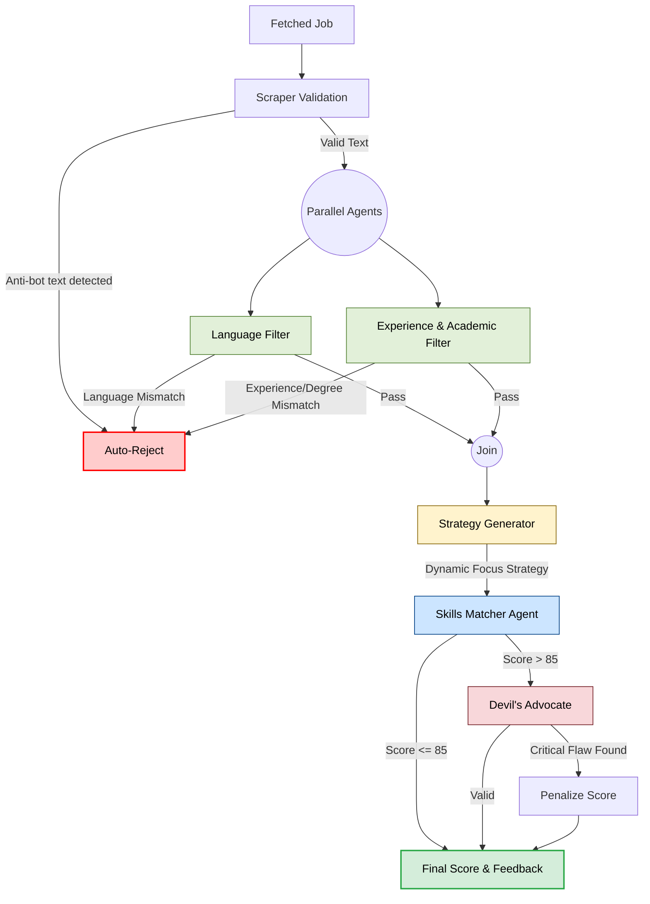
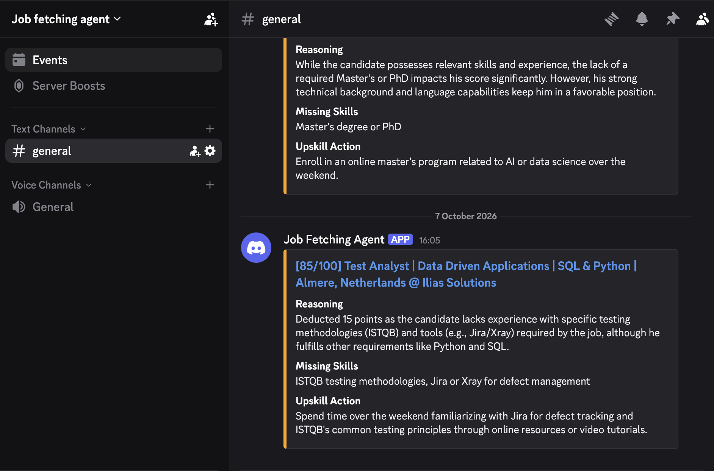

# AI Job Fetching Agent

An automated pipeline designed to scrape, evaluate, and fetch job listings daily, and give a matching score tailored to specific criteria and user's profile. This project uses web scraping and the LLM to match job descriptions against user-defined preferences.

- **Job Scraping**: Automatically fetches job listings (e.g., AI Engineer, Robotics Engineer) in specified locations, using JobSpy API (`https://github.com/speedyapply/JobSpy`).
- **Multi-Agent Evaluation Pipeline**: Analyzes job descriptions using a funnel of multiple specialized AI agents (Language, Experience, and Skills) to accurately determine match scores while optimizing costs.
- **Dockerized API**: Fully containerized FastAPI backend.
- **Cloudflare Tunnels**: Ready to be securely exposed to the web using Cloudflare Tunnels. (optional)


## Guidance to run

### 1. Personalize
The project is based on prompt engineering through the pipeline, therefore the prompts might have to be adjusted to match the candidate's needs, if you profile is different than mine. In my case, I am a recent graduate, I do not have the relevant work experience yet, therefore I specify how to handle this and describe instructions on how to calculate the match score.

Hence you might want to update:

`app/services/cv_parser.py`

and maybe the specific agent files inside `app/agent/`:
- `language_agent.py`
- `experience_agent.py`
- `skills_agent.py`


### 2. Quick Start (Local Testing)
The easiest way to use the pipeline locally is using Docker.

1. **Configure Environment:** 
   Copy `.env.example` to `.env` and add your API keys (and your DISCORD_WEBHOOK_URL to receive match alerts!).
2. **Start backend:**
   ```bash
   docker-compose up -d --build
   ```
3. **Upload a CV:**
   Use the `/upload-cv` endpoint to parse and cache a candidate profile as json file extracted by the cv parser script.
   ```bash
   curl -X POST "http://localhost:8000/upload-cv" \
        -H "accept: application/json" \
        -H "Content-Type: multipart/form-data" \
        -F "file=@/path/to/your/resume.pdf"
   ```
4. **Trigger the Pipeline:**
   Start the multi-agent scraping and evaluation pipeline in the background.
   ```bash
   curl -X POST "http://localhost:8000/trigger-pipeline" \
        -H "accept: application/json" -d ""
   ```
5. **Watch the Agents Work:**
   ```bash
   docker-compose logs -f api
   ```

### 3. Advanced Deployment (Production)
The provided `docker-compose.yml` is already configured to optionally expose the API to the web via a **Cloudflare Tunnel** (cloudflared). This is useful if you are hosting the agent on a home server and want to trigger pipelines remotely or receive webhooks securely without opening router ports.

1. Ensure your `CLOUDFLARE_TUNNEL_TOKEN` is set in your `.env` file.
2. The `cloudflared` service in `docker-compose.yml` will automatically route external traffic to the internal API container.


### 4. Local Development (Without Docker) - in case someone does not have Docker installed; Python 3 is still required though
1. **Create and activate a virtual environment:**
   ```bash
   python -m venv venv
   source venv/bin/activate
   ```
2. **Install dependencies:**
   ```bash
   pip install -r requirements.txt
   ```
3. **Configure Environment:** 
   Copy `.env.example` to `.env` and add your API keys (and your DISCORD_WEBHOOK_URL to receive match alerts!).
4. **Run the API:**
   ```bash
   uvicorn app.main:app --reload
   ```


## Pipeline Architecture & Data Flow

To ensure high accuracy and low cost, the evaluation process is orchestrated as a stateful graph using **LangGraph**. Cheap and fast filters (langdetect and gpt-6-luna) run in parallel to remove irrelevant jobs early, reserving the more expensive, high-intelligence model (gpt-6.1-sol) only for the best matches.



## Project Structure

```text
agent_jobfetching/
├── app/                  # Main application package
│   ├── agent/            # Multi-agent pipeline logic
│   │   ├── language_agent.py   # Language filter (langdetect & gpt-6-luna)
│   │   ├── experience_agent.py # YoE and seniority filter
│   │   ├── skills_agent.py     # Skills evaluation (gpt-6.1-sol)
│   │   └── matcher.py          # Orchestrates the agents in sequence
│   ├── core/             # Core utilities and settings
│   ├── models/           # Data models (Pydantic/SQLAlchemy)
│   ├── services/         # Business logic (e.g., scraper integration)
│   └── main.py           # Application entrypoint (FastAPI)
├── data/                 # Directory containing the SQLite database (jobs.db)
├── tests/                # Unit and integration tests
├── .env.example          # Example environment variables
├── docker-compose.yml    # Docker setup for local server & Cloudflare tunnel
├── Dockerfile            # Docker instructions for building the API
├── pyproject.toml        # Project configuration
├── requirements.txt      # Python dependencies
├── run_job_scraper.py    # Utility script to test scraping
└── clear_db.py           # Utility script to reset the database
```


### The Agents & Graph Nodes:
1. **Scraper Validation Node**: Automatically rejects scraped postings filled with anti-bot/captcha text, saving LLM tokens.
2. **Language Agent**: Uses `langdetect` (free) to reject jobs in foreign languages, falling back to `gpt-6-luna` to verify explicit language fluency requirements. Runs in parallel with the Experience Agent.
3. **Experience & Academic Agent**: Uses `gpt-6-luna` to strictly enforce Years of Experience (YoE) and **academic degrees** (e.g., rejecting Postdoc roles if the candidate only has a BSc).
4. **Strategy Generator**: A cheap LLM node that dynamically generates a 1-sentence evaluation strategy specifically tailored to comparing the current JD with the candidate's profile.
5. **Skills Matcher Agent**: Uses flagship models (`gpt-6.1-sol`) alongside the dynamic strategy to deeply analyze projects and skills for the final match score.
6. **Devil's Advocate**: Acts as Quality Assurance. If the Skills Matcher returns a score > 85, this node re-analyzes the match to aggressively find any critical flaws the optimistic agent missed, applying heavy penalties to prevent false positives.

### Cost & Token Optimization
The pipeline includes several architectural decisions designed to minimize API costs:
- **LangGraph Parallel Agents:** (`language_agent` and `experience_agent`) run concurrently using `asyncio.gather`. If either rejects the job, the graph aborts instantly, slashing processing latency by 50% while protecting the expensive `skills_agent` by waiting until both `language_agent` and `experience_agent` pass a succesfull job posting.
- **Dynamic Offset Pagination:** The scraper iteratively fetches jobs in batches of 100 via offset pagination, stopping exactly when the daily budget quota of 25 evaluated jobs is met (evaluated by `skills_agent` only, after the filtering of `language_agent` and `experience_agent`).
- **Prompt Caching:** The `skills_agent` dynamically places the static system prompt (containing the candidate's profile) at the very beginning of the API request. Because jobs are processed sequentially, OpenAI automatically caches this prompt prefix, granting a **50% token discount** and lower latency on all subsequent job evaluations in that batch (Anthropic allows cache prompting too, however their current flag models refuse these prompts because of Privacy and HR use guidelines violation).
- **JSON Minification:** In `skills_agent.py`, the candidate's complex JSON profile is strictly minified (removing all spaces and newlines) before being sent to the LLM. This saves hundreds of whitespace tokens per API call.
- **Job Description Boilerplate Stripping:** A regex heuristic in the scraper truncates useless HR text (like "About us", "Benefits & Perks", or "What we offer") from raw job descriptions, which is not really relevant for candidate's match scoring. This saves 300–700 input tokens per evaluated job posting without degrading technical match quality.
- **Output Token Throttling:** API generation overhead is heavily constrained. Filter agents strictly return an empty string for reasoning if a job passes. The `skills_agent` explicitly enforces single-sentence reasoning fields and sets a strict API `max_tokens` ceiling, slashing output token costs by over 60%.

#### Estimated Costs
Based on current pricing with the optimization techniques active:
- **Full initial run** (CV parsing + pipeline triggering with 25 jobs evaluated): **~$0.49**
- **Daily pipeline run** (evaluating 25 jobs with CV already cached): **~$0.30**

Considering the use of:
-gpt-6-luna (for experience and language agents fallback)
-gpt-6.1-sol (for skills agent)
-claude sonnet 5.5 (for CV parsing and profile extraction)


## Utility Scripts

There are 2 seperate `.py` scripts at the root level, like `run_job_scraper.py` and `clear_db.py`. These are used for testing and database management outside the main API loop, useful for anyone running the pipeline.

### `run_job_scraper.py`
This script allows you to independently test the job scraping service without running the full AI evaluation pipeline. It fetches jobs for predefined titles (like "AI Engineer", "Robotics Engineer") in a specific location (e.g., "Netherlands") and prints the results directly to your console. 
- It is great for debugging scraper issues, verifying API keys, and quickly checking what job data is currently available on the market when retrieving from the API key.
- It is then also useful prompt engineering for the 3 agents. If you know what data is retrieve, you can speciilize your agents for filtering and scoring correctly.

### `clear_db.py`
The agent uses a local SQLite database (`data/jobs.db`) to keep track of which jobs have already been evaluated, ensuring it doesn't process the same job twice. Running this script deletes all records from the `processed_jobs` table.
- If you want to reset the pipeline state (for example, if you tweaked the AI agent's prompt and want it to re-evaluate jobs it previously skipped), running this script will make the pipeline treat all found jobs as brand new.

## Demonstration

When the multi-agent pipeline finds a highly relevant job that passes the language filter, experience gatekeeper, and scores high enough on the skills matcher, it automatically sends a webhook alert to Discord channel. You can read on how to set it up here:
`https://support.discord.com/hc/en-us/articles/228383668-Intro-to-Webhooks`



